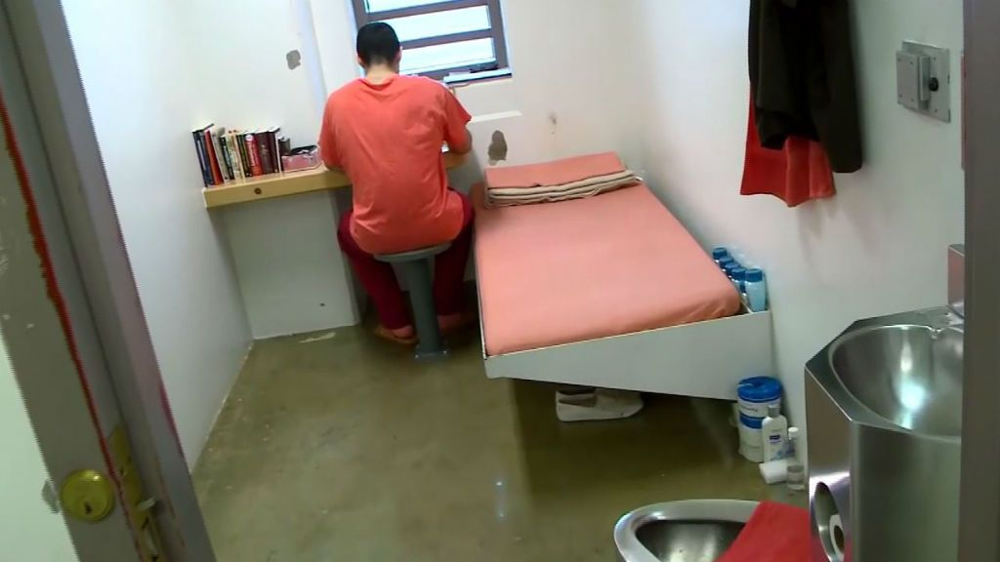

## Life in Quarantine 

I've never really wondered what life in prison was like but ever since, the quarantine went into effect I've wondered several times if this was what prison is like. I am used to waking up in the morning, leaving the house to get my day started. Over the years I have conditioned myself to start my work day the second I leave the house. School is online now and that is just a joke, there are some classes that are better learned in a class room setting especially math intensive classes.  

## Daily Routine

My daily routine has been confined to my desk beside my bed, I don't wish this on anyone solidarity is the killer of creativity. Being at home seeing the same scenery everyday isn't very good for my focus or my zen. To be creative I think your brain has to be stimulated by multiple things in order to generate awesome new ideas. Family is also only good in moderation just like anything, too much of each other is bad.  

## Online Classes is a joke
I used to think online school would be easier but since most my classes are math intensive, I feel like I can't follow the lecture as well as when we were in a classroom setting. Its been getting harder to build a intuition about concepts discussed in class and the online lecture is pretty much a waste of time since I have to spend more time readin text book material to really understand the material. Further more professors lose the ability to dynamically adapt their pace to the learning rate of the students, since many professors rely on reading the facial expressions of students to gauge if they understand the material or not. There is a reason why online schools are cheaper and I think its because you are getting a lower quality education. 

## Reflecting on the past and moving forward

After not seeing my friends for a longtime and still being able to keep in touch I have realized I have some amazing friends. I have also realized the friends who are not really all that great which are the ones that doesn't keep in touch. I realized my parents are really caring since they never stop reminding me to becareful and I realized some members are not as great as I think they were. To move forward I think I need to learn to focus better at home and adapt to this new boring routine. I got a code today so lets hope the future isn't terrible for me.