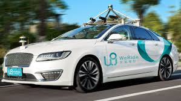

## What is Ethics?

Ethics to me is a professional and personal convention, a rough basic outline of how you should conduct yourself in the workplace. Since your work plays a big role in how people view you as a person, it is important that your work doesn't make you a person you dislike in the views of your colleagues and the world as a whole. In the software engineering aspect ethics to me is doing work that doesn't cause harm, and to ensure that what you make doesn't have the potential to cause harm to people or the world as a whole. Personally my philosophy is I want to give a positive impact on the world and to do so I must be diligent on the type of work I do so that I can avoid unintentionally causing harm from a side effect of something that I produce. The type of things I consider negative are causing harm and suffering to anything living, negative environmental impacts, and wasting resources. 

## Self Driving Cars
In the case of self driving cars and implication arises on the topic of unavoidable accidents. In normal cars the responsibility of making a life or death decission is placed on the hands of the driver and the manufacturer bares no responsibility on the harm the car creates as long as the vehicle is working properly. In the case of self driving cars the responsibility is placed on the manufacturer since the cars decisions are preprogramed by the manufacturers. Another dillema is that in the situation of an unavoidable accident where no matter what someone has to die for someone else to live, should the car take a utilitarian approach or a owner centered approach. If the car had to either sacrafice pedestrians or its occupants what should it do? This is a tough question because there are multiple ways you can approach this, since the owner bought the car the highest priority would be the passenger inside the car 

## My Solution

In my opinion since the owner of the car will be the one using the vehicle, it is their responsibility to decide what the car does in those situations. Ultimatly at the end of the day if I was to put me and my families life in someone's hands it would be me. I think that manufacturers will agree that it is at everyones best interest if the owner would make those calls on their own with customized settings. The manufactuerer has its foremost obligations which is to the person buying the car. By letting the driver choose what happens it takes liabilities off of the manufactureres hands and puts it right back into the drivers. A good question to ask is would you get in a car that you know would sacrafice you if it had the chance? 
