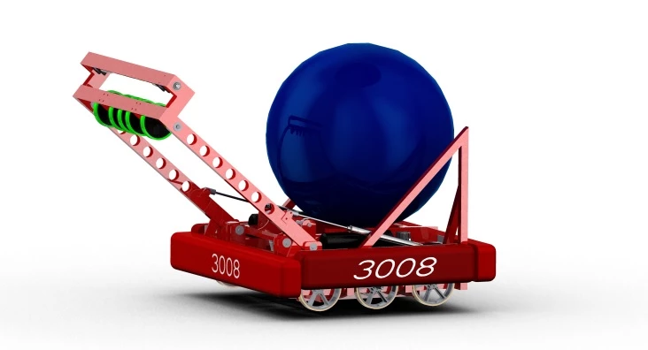

  
  

The FIRST Robotics Competition releases a new game annually in which a team participating will have six weeks to design and build a 
robot that can perform a certain task within 2 minutes. The game for the year 2014 was called Aerial Assist, the objective of the game was to pick up a excercise ball from one end of the field, pass the ball to each of your teammates, and then finaly score the ball in a goal eight feet tall. 

For this project, I was the lead designer/project manager responsible for the integration of multiple subsystems of the robot. I started with producing a 3d model of the proposed design using a computer aided design software called Creo parametrics. with a detailed design of the robot I was able to break down each subsystem allowing work to be done in parallel between subsystems. While doing this project I've gained the skill of being able to split up a project between team members to get the work done fast and efficient.    

