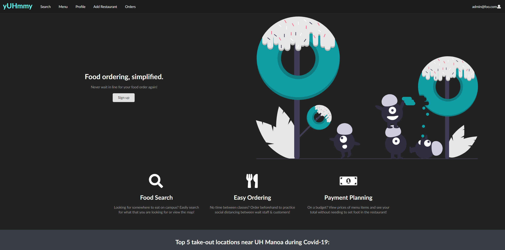
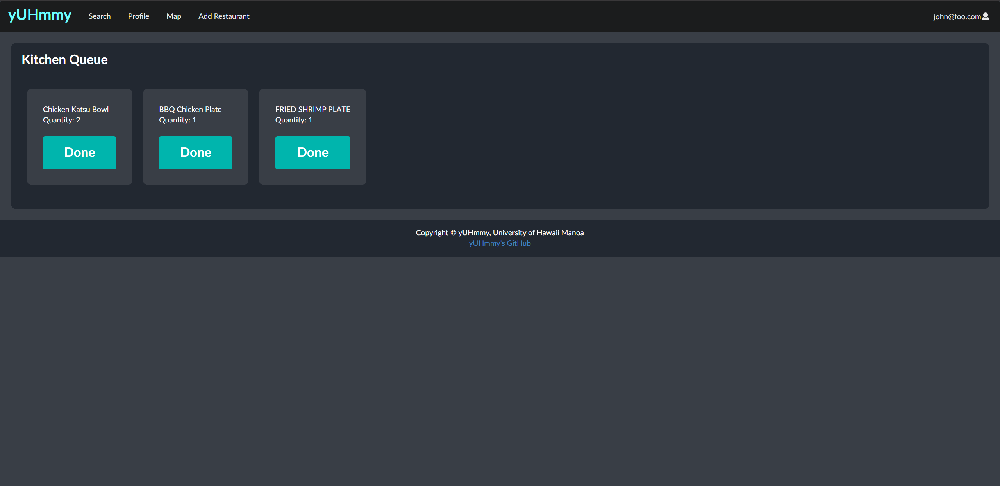

## The Project
yUHmmy is an app built to improve the dine-in experience for customers and restaurant owners. yUHmmy allows customers to order food, drinks and request for service with a tap on their screen. Often times restaurants and bars get negative reviews because a customer had to wait too long to get serviced, but with the yUHmmy app customers can place an order from their phone without having to wait for a waitress. This allows the customers to focus on entertaining their guests and waitreses to focus on bring food and drinks. 
The app is helpful for those who have trouble tracking down a waitress, or getting a bartender's attention. This is most useful for restaurants as it frees up the waitstaff to bring out food faster therefore help the restaurant make more money. 

The project was built using Meteor, React, Semantic-UI frameworks, and mongoDB.

## What I did

This was an idea that I came up with when I was stuck in line for half an hour waiting to close a bar tab. For this project I implemented the page that allows the restaurant to see orders as it comes in and manages the queue for production. The page extracts orders from a central database using the restaurant IDs and displays every order in the order that it is received. As orders get finished they get taken out of the queue so the page is constantly updating.  
